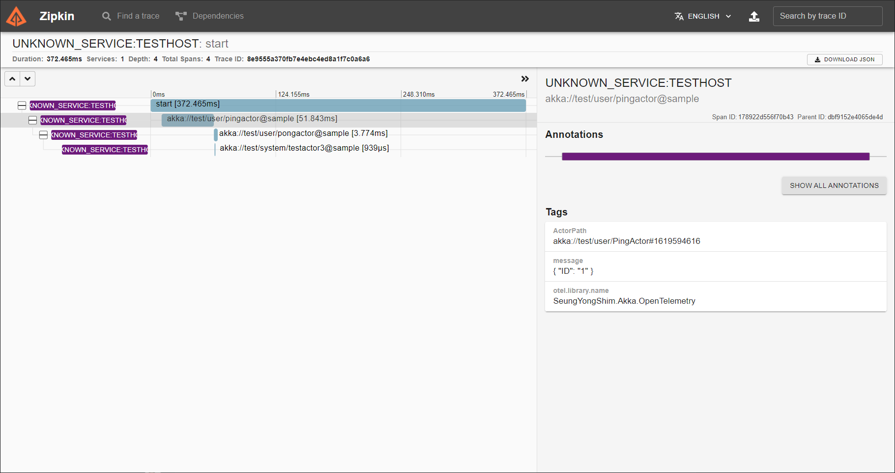

## 1. SeungYongShim.Akka.DependencyInjection
### Production
``` csharp
[Fact]
public async Task Production()
{
    // Arrange
    var host = Host.CreateDefaultBuilder()
                   .UseAkka("ProductionSystem", string.Empty, sys =>
                   {
                       sys.ActorOf(sys.PropsFactory<ParentActor>().Create(), "Parent");
                   })
                   .Build();

    await host.StartAsync();
    var actorSystem = host.Services.GetService<ActorSystem>();

    // Act
    var ret = await actorSystem.ActorSelection("/user/Parent")
                               .Ask<string>("Hello");

    ret.Should().Be("Hello, Kid");

    await host.StopAsync();
}
```
### UnitTest using TestActor
```csharp
[Fact]
public async Task Check_Child_Actor_Recieved_Messages()
{
    // Arrange
    var host = Host.CreateDefaultBuilder()
                   .UseAkka("TestSystem", string.Empty, sys =>
                   {
                       sys.ActorOf(sys.PropsFactory<ParentActor>().Create(), "Parent");
                   })
                   .UseAkkaWithXUnit2(typeof(ChildActor))
                   .Build();

    await host.StartAsync();

    var testKit = host.Services.GetService<TestKit>();

    // Act
    testKit.ActorSelection("/user/Parent").Tell("Hello");

    // Assert
    testKit.ExpectMsg<string>().Should().Be("Hello, Kid");

    var child1 = await testKit.Sys.ActorSelection("/user/Parent/Child1")
                                  .ResolveOne(5.Seconds());
    child1.Path.Name.Should().Be("Child1");

    await host.StopAsync();
}
```

## 2. SeungYongShim.Akka.OpenTelemetry
### TraceLocalActorRefProvider Only
* Not Support Remote, Cluster
* Not Support Local Router

